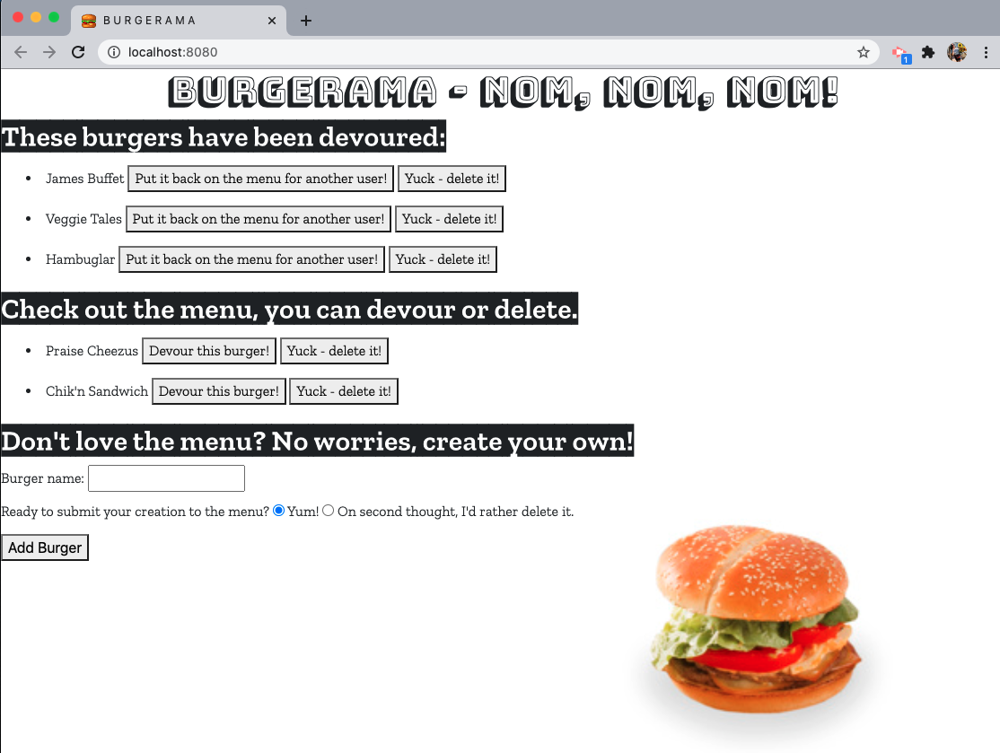

# 13: Burgerama
---

## Description 

For this app, I created a burger logger using MySQL, Node, Express, Handlebars and a homemade ORM and MVC design pattern. Burgerama app allows the user to input names of burgers they'd like to eat, they can devour this burger or another one on the menu. 

---

## Development Process 

At some points in development, my code worked perfectly with all GET and POST functions executing. At other points, the code broke completely due to path issues and file structure problems. This is a major issue I need to resolve in order to further my web development path. I've outline some of my process below.

 - [ ] Directory structure
     - [ ] Make folders to hold app files in an organized manner
     - [ ] Use these folders to create correct routes within files
- [ ] DB setup 
    - [ ] Create burgers_db and connect MySQL 
    - [ ] Create table within db allowing for a name and if the burger is devoured
    - [ ] Insert seed data to db
    - [ ] Stores all burgers in the db 
- [ ] Node packages
    - [ ] Express, MySQL & Handlebars all required
    - [ ] Node command line called on server.js
- [ ] Notable files  
    - [ ] orm.js allowing functionality - insert & delete
    - [ ] controller contains routes to GET, PUT and DELETE
    - [ ] burgers.js holds fetch method for buttons as well
    - [ ] handlebars generates the main and index html files - addition of partial burger-block for user input data to be displayed
- [ ] Heroku
    - [ ] App needed to be deployed to Heroku
    - [ ] Live link included below  
- [ ] Portfolio 
    - [ ] Update portfolio with Heroku link
- [ ] Styling
    - [ ] Added fonts + photos
    - [ ] Cheeseburger favicon
    - [ ] Future development would include cards for the menu 

---

## Installation 

NPM install for express, MySQL & handlebars - other files required throughout the app once they are created. 

--- 

## Preview 

---

## Heroku Link 

https://ancient-fjord-29833.herokuapp.com/

---

## Github Link

https://github.com/vshulman25/burgerama

--

## Credits

Developer - Victoria Shulman 
